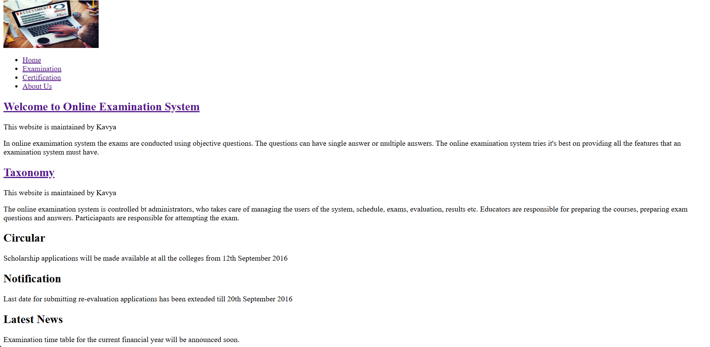
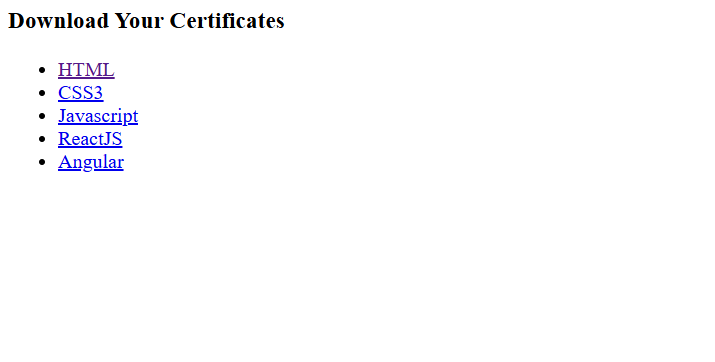
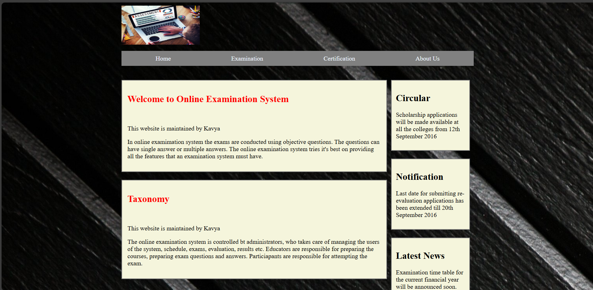
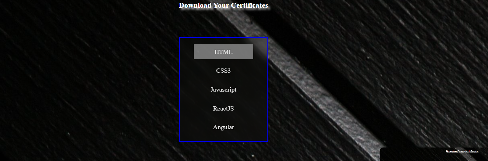

#   CSS Capstone Project 1

This is the simple styling project, here infosys springboard provided me a non-styled project and my task is to the provide the style, for home page and certificate nav page

## BEFORE 
**Home Page**

**Certificate nav page**

**AFTER** 
**Home Page**

**Certificate nav page**
